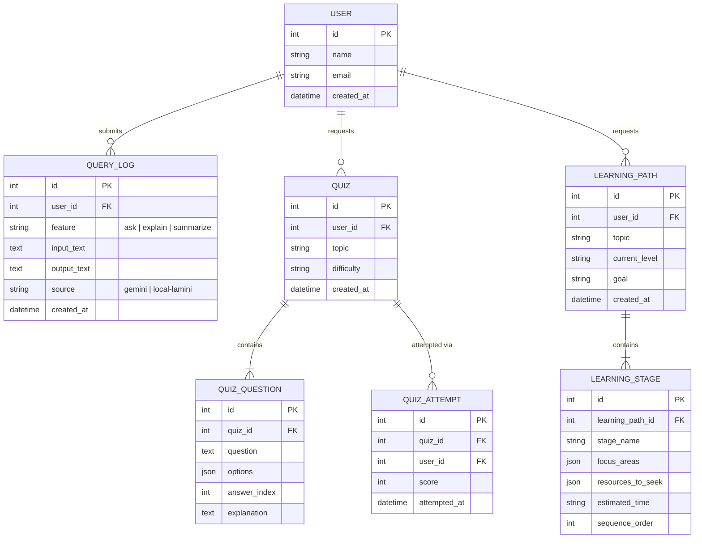

# ER Diagram

## Current state

EduGenie's core app (`main.py`) is **stateless** — every request to
`/api/ask`, `/api/explain`, `/api/quiz`, `/api/summarize`, and
`/api/learning-path` is answered directly from the AI model and nothing is
persisted. This satisfies the brief's five learning features without a
database, and is why `requirements.txt` doesn't include a DB driver.

The project brief's hardware/software requirements list a database
(SQL / PostgreSQL / SQLite) as an intended part of the stack — that layer
is designed below and ready to add whenever you want to support saved
history, user accounts, or progress tracking.

## Proposed schema (for saved history / accounts)

## Notes

- **USER** anchors all history so a student can revisit past answers, quizzes,
  and learning paths.
- **QUERY_LOG** stores every Ask/Explain/Summarize interaction, including
  which backend (`gemini` vs `local-lamini`) answered it — useful both for
  a "history" feature and for auditing model usage/cost.
- **QUIZ** / **QUIZ_QUESTION** normalize the JSON quiz payload the API
  already returns, so a saved quiz can be re-taken later.
- **QUIZ_ATTEMPT** is separate from **QUIZ** so the same quiz can be
  attempted multiple times and scored for progress tracking.
- **LEARNING_PATH** / **LEARNING_STAGE** mirror the existing
  `LearningPathResponse` schema in `app/schemas.py`, just normalized into
  rows instead of nested JSON.
- Recommended engine: **SQLite** for local development (zero setup, matches
  the brief's "Database(sql/PostgreSQL/sqlite)" requirement), **PostgreSQL**
  for production. `SQLAlchemy` + `Alembic` would be the natural fit if this
  layer is implemented, since the app is already async/FastAPI-based.
