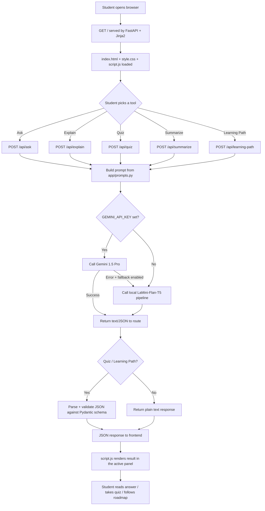

# Project Flow

## End-to-end request flow

## Development workflow (Epics 1-4)

1. **Epic 1 — Model Selection and Architecture**
   Decide the AI backend strategy: Gemini 1.5 Pro as primary, local
   LaMini-Flan-T5 as fallback. Documented in `docs/ER_DIAGRAM.md` isn't
   relevant here — see `README.md` "Notes on architecture".

2. **Epic 2 — Core Functionalities Development**
   Implement the five educational features as isolated prompt templates
   (`app/prompts.py`) and a shared model-calling layer (`app/ai_service.py`),
   then expose them as FastAPI routes (`main.py`).

3. **Epic 3 — Frontend Development**
   Build the web interface (`templates/index.html`, `static/style.css`) and
   wire it to the backend with `fetch()` calls (`static/script.js`) — this
   is the "Live Integration" task.

4. **Epic 4 — Deployment**
   Run locally with `uvicorn main:app --reload`, verify functionally with
   the test suite in `tests/`, then containerize/deploy (see
   "Next steps (deployment)" in `README.md`).

## Data flow per feature (summary)

| Feature | Input | Prompt template | Output shape |
|---|---|---|---|
| Ask | free-text question | `ASK_PROMPT` | plain text |
| Explain | concept + level | `EXPLAIN_PROMPT` | plain text |
| Quiz | topic + count + difficulty | `QUIZ_PROMPT` | JSON → `QuizResponse` |
| Summarize | text + length | `SUMMARIZE_PROMPT` | plain text |
| Learning Path | topic + level + goal | `LEARNING_PATH_PROMPT` | JSON → `LearningPathResponse` |
